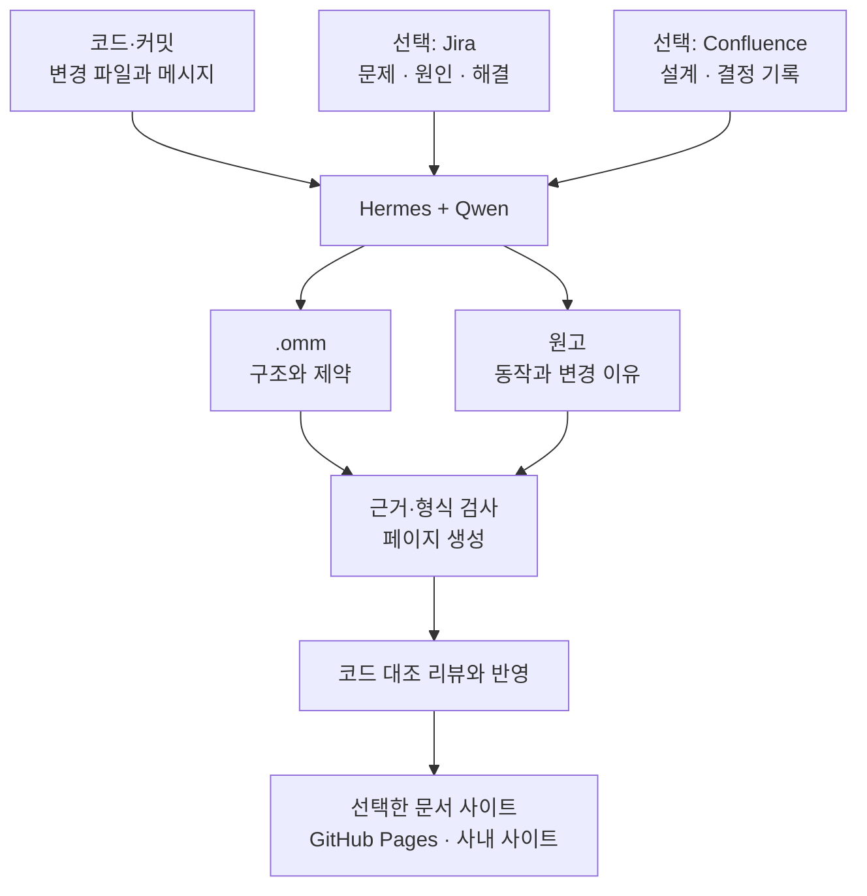
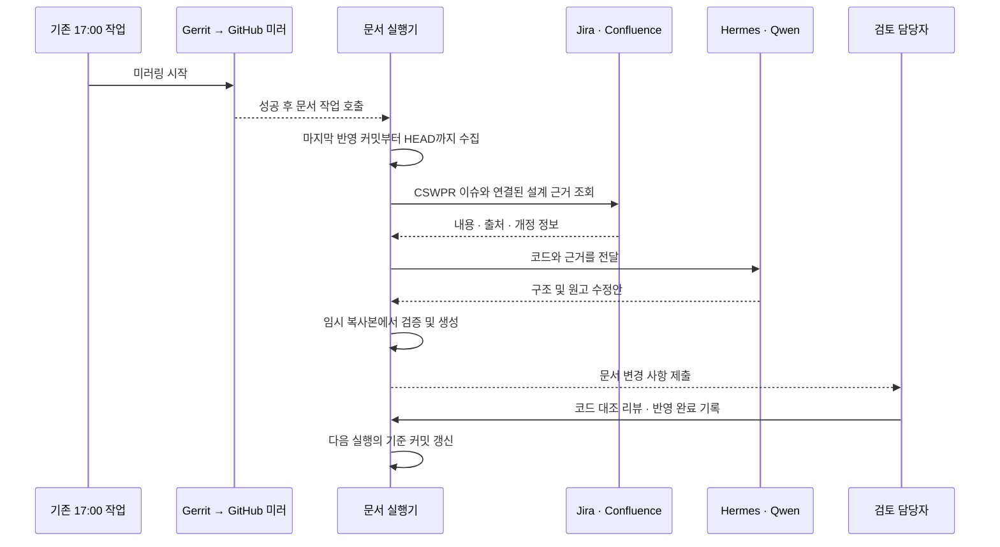
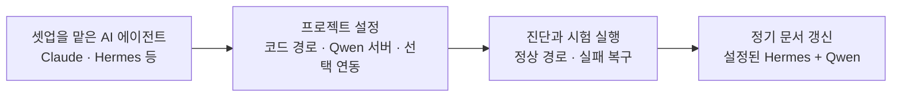
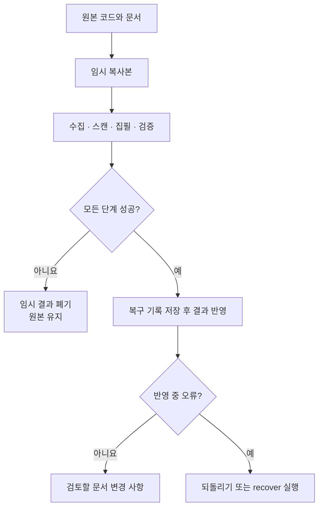

# OMM Doc Workflow

**코드 저장소와 문서 프로젝트를 지정하면, 에이전트가 코드·이슈·설계 근거를 모아 문서 수정안을 만듭니다.** 먼저 [AI 에이전트용 셋업 안내](SETUP.md)를 설치를 맡길 Claude 또는 Hermes에 전달하세요.

이 시스템은 Camera HAL처럼 여러 모듈과 변경 이력이 연결된 코드의 문서화를 위한 공용 실행기입니다. 시스템 자체는 독립 저장소에서 관리하며, 각 프로젝트는 코드 경로·문서 목차·연동 설정을 별도로 보관합니다. 현재 HALCamera 앱도 같은 실행기를 사용하도록 연결합니다.

## 한눈에 보는 실행 흐름



**코드 동작, 이슈의 원인·해결 내용, 설계 결정은 서로 다른 근거입니다.** Jira의 Solution에 적힌 내용만으로 구현 완료를 단정하지 않습니다. 설계 의도는 연결된 기록에서 확인한 경우에만 설명합니다.

## 필요한 기능만 선택합니다

| 선택 항목 | 지원하는 구성 | 설정 위치 |
| --- | --- | --- |
| 코드 위치 | 문서와 같은 저장소 또는 별도 코드 저장소 | `sourceRoot`, `--source` |
| 변경 감지 | 작업본 전체의 해시 비교 또는 검토 기준 커밋 이후의 변경 | `changes.mode` |
| 실행 에이전트 | Hermes 또는 로컬 Ollama 직접 호출 | `agent.kind` |
| 모델 | 프로젝트에서 지정한 Qwen 모델 | `agent.model`, `agent.baseUrl` |
| 이슈 근거 | 사용하지 않거나 Jira에서 수집 | `jira.enabled` |
| 첨부 그림 | 출처 링크 수집 또는 제외 | `jira.attachments` |
| 설계 근거 | Jira에 연결된 Confluence 문서를 추가 수집 | `confluence.enabled` |
| 문서 목차 | 프로젝트가 지정한 페이지·구조·원고 블록 | 바인딩 파일 |
| 시각적 형식 | Slack, plain 또는 프로젝트 CSS | `design.preset` |
| 사실 추출 | 기본값 없이 시작하거나 프로젝트용 추출기 연결 | `factsAdapter` |
| 실행 시점 | 수동 실행 또는 기존 미러링 작업의 성공 후 호출 | 외부 작업 스케줄러·CI |
| 배포 | 생성 파일을 프로젝트의 기존 배포 과정에 전달 | 프로젝트별 CI |

Jira와 Confluence를 사용하지 않는 프로젝트도 코드만으로 동작합니다. Confluence 자동 수집은 Jira에 연결된 페이지를 대상으로 합니다. 배포는 생성과 분리되어 있으며, 공용 실행기가 임의로 사이트를 공개하지 않습니다.

## 사내 Camera HAL 운영 예

기존 Gerrit 미러링이 매일 **17:00 한국 시간**에 시작된다면, 문서 작업은 미러링 성공 후 연결합니다. 두 작업을 17:00에 각각 시작하면 문서 작업이 이전 코드를 읽을 수 있습니다.



생성 성공과 문서 반영 완료는 구분합니다. `sync`는 검토 승인을 만들거나 처리 기준 커밋을 넘기지 않습니다. 검토·반영 후 `ack`로 기준을 기록하므로, 실패하거나 검토가 남은 구간은 다음 실행에서도 유지됩니다.

## 셋업 에이전트와 실행 에이전트는 다릅니다



셋업을 맡은 에이전트는 [AGENTS.md](AGENTS.md)와 [SETUP.md](SETUP.md)를 읽고 프로젝트 설정을 작성합니다. 설치에 Claude를 사용해도 정기 문서 작성 모델은 설정된 Qwen을 사용합니다.

## 문서 작성 원칙

배포 사이트의 기본 시각적 형식은 설치한 [Slack DESIGN.md](DESIGN.md)를 따릅니다. **[디자인 설정](docs/design.md)을 바꾸면 다른 형식으로 전환할 수 있습니다.** GitHub README 자체의 색상은 GitHub가 정하며, 테마 CSS는 배포 사이트에 적용됩니다.

모든 원고는 [공통 집필 규칙](style/README.md)을 따릅니다. [i-have-adhd](https://github.com/ayghri/i-have-adhd)와 [fluent-korean](https://github.com/snflkd/fluent-korean)의 원문과 라이선스를 저장소에 보관하고 집필 프롬프트에 전달합니다.

1. 독자가 해야 할 행동과 핵심 결론을 먼저 설명합니다.
2. 여러 단계는 짧은 번호 목록으로 나누고, 한국어 문장은 의미가 분명한 완전한 문장으로 씁니다.
3. 코드 사실과 문서 근거를 구분하고, 확인하지 못한 내용은 확인 필요로 표시합니다.
4. 상세한 출처와 검토 정보는 접어서 확인할 수 있게 배치합니다.

## 원본을 보호하는 방식



실행 중 원본이 바뀌면 결과를 반영하지 않습니다. 원고 하나가 실패해도 앞서 작성한 원고만 따로 반영하지 않습니다. 복구 대상에 후속 편집이 있으면 해당 편집을 덮어쓰지 않고 중단합니다.

## 주요 명령

```bash
node bin/docflow.mjs doctor --project /work/camera-hal-docs --source /work/camera-hal
node bin/docflow.mjs sync --project /work/camera-hal-docs --dry-run
node bin/docflow.mjs sync --project /work/camera-hal-docs
node bin/docflow.mjs sync --project /work/camera-hal-docs --recover
```

설정 파일은 기본적으로 문서 프로젝트의 `docflow.json`입니다. 다른 경로는 `--config`로 지정합니다. [Camera HAL 예제](examples/camera-hal/)와 [설정 안내](docs/configuration.md)를 참고하세요.

정기 실행은 [미러링 연동 안내](docs/mirror-integration.md)를 따릅니다. 공개 프로젝트에서는 공용 엔진을 별도로 설치해 호출하며, 비공개 시스템 저장소 전체를 공개 저장소에 복사하지 않습니다.

## 검증 범위와 현재 제한

[실행·복구 검증 기록](docs/validation.md)에 실제 Qwen 실행과 모의 연동 검사를 구분해 정리했습니다.

로컬 Qwen 3.5 4B로 작은 테스트 코드의 변경이 OMM 부모·자식 설명과 생성 페이지에 반영되는 것을 확인했습니다. 시간 초과, 잘못된 응답, OMM 오류, 원고 실패, 파일 반영 실패와 복구도 테스트합니다. 현재 앱의 기존 문서 검사와 공용 실행기 검사는 각각 유지합니다.

사내 Hermes 설치본, 실제 Jira 필드, Confluence 권한, 미러링 완료 신호는 사내 셋업에서 확인해야 합니다. Jira의 첨부 그림은 현재 출처 링크를 수집하며, 그림의 내용을 읽었다고 표시하지 않습니다. 입력이 모델 한도를 넘으면 잘라 보내지 않고 실패합니다. 큰 HAL 저장소는 모듈 단위로 근거 범위를 나누어 구성해야 합니다.

**다음 단계:** [SETUP.md](SETUP.md)를 셋업 에이전트에게 전달하고, 사내 코드 경로와 Qwen 서버부터 연결하세요.
