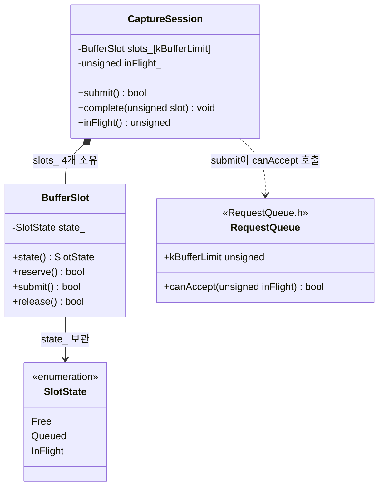
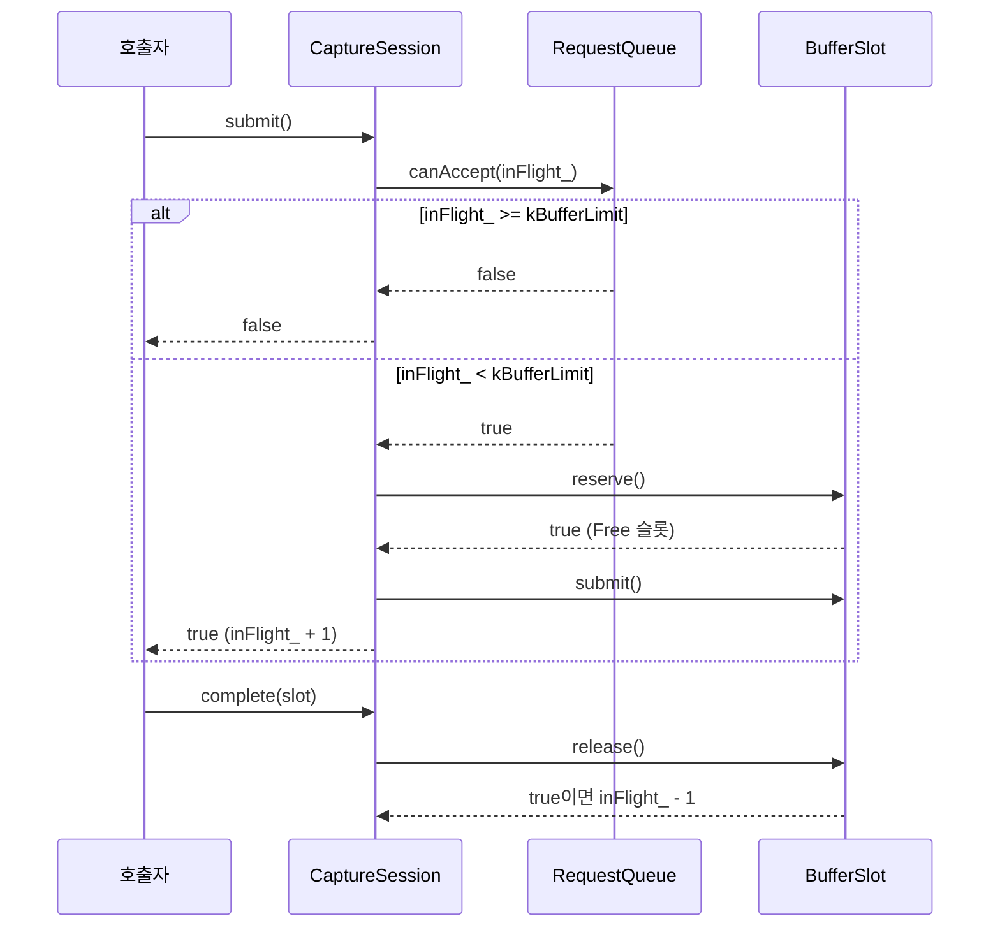
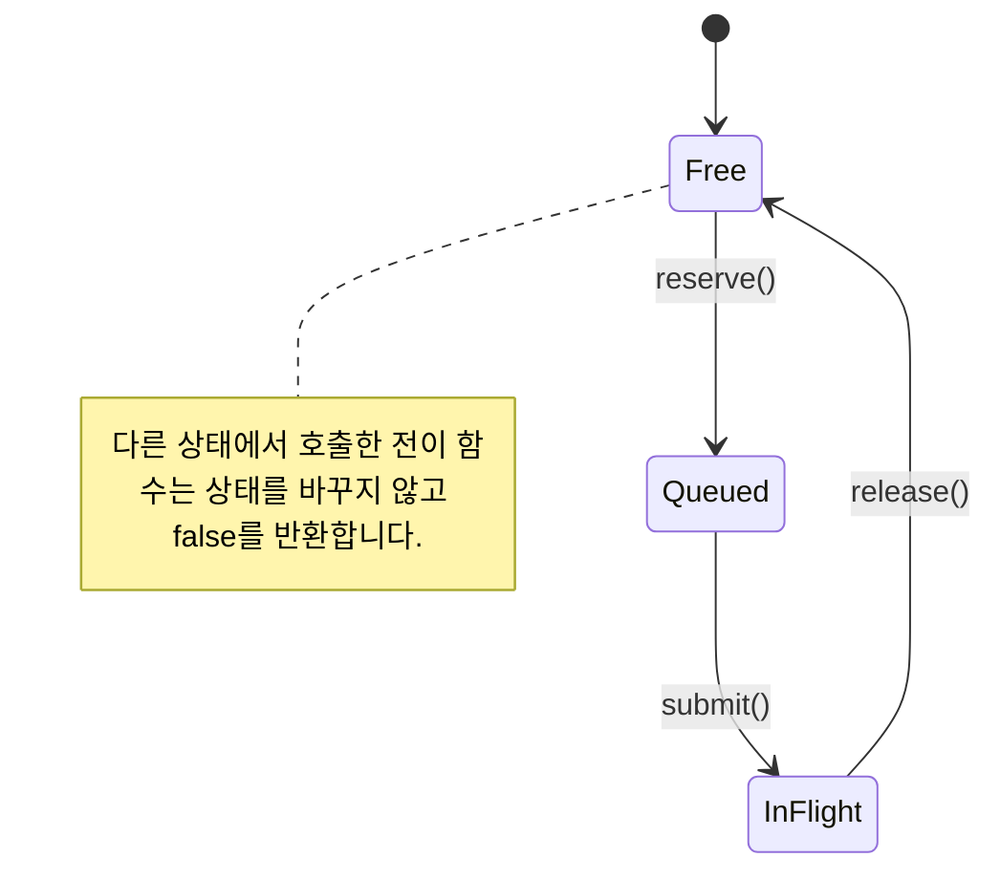

# 요청 수용 조건

**먼저 RequestQueue.h의 kBufferLimit과 RequestQueue.cpp의 canAccept를 함께 확인하세요.** 이 페이지는 실행기 시험용 예제이며 실제 제품의 HAL 설계 문서가 아닙니다.

<!-- omm:begin id=status -->

| 항목 | 최신성 | 검토 |
| --- | --- | --- |
| 구조 원본 `buffer-ownership` | 검증 정보 없음 | — |
| 구조 원본 `request-flow` | 검증 정보 없음 | — |
| 구조 원본 `request-lifecycle` | 검증 정보 없음 | — |
| 구조 원본 `session-structure` | 검증 정보 없음 | — |
| 원고 `overview` | 검증 정보 없음 | — |

<!-- omm:end id=status -->

## 구조

<!-- omm:begin id=diagram -->

근거와 검토 정보

- 근거: `.omm/request-flow/diagram`
- 근거 수준: 코드 확인

<!-- omm:end id=diagram -->

## 코드 동작

<!-- omm:begin id=overview -->

canAccept는 처리 중인 버퍼 수가 4보다 작을 때 true를 반환합니다. 4 이상이면 false를 반환합니다. 경곗값은 RequestQueue.h의 kBufferLimit에 정의되어 있습니다.

근거와 검토 정보

- 근거 파일: `RequestQueue.h`, `RequestQueue.cpp`
- 근거 수준: 코드 확인
- 검토 상태: 검증 정보 없음

<!-- omm:end id=overview -->

## 클래스 구조

CaptureSession이 BufferSlot을 소유하고 canAccept를 호출하는 관계입니다. `session-structure` 관점은 `diagram_type: class`로 설정되어 있습니다.

<!-- omm:begin id=class-diagram -->

근거와 검토 정보

- 근거: `.omm/session-structure/diagram`
- 근거 수준: 코드 확인

<!-- omm:end id=class-diagram -->

## 요청 처리 순서

submit 한 번이 canAccept 확인, 슬롯 예약, 제출 순서로 진행됩니다. `request-lifecycle` 관점은 `diagram_type: sequence`로 설정되어 있습니다.

<!-- omm:begin id=sequence-diagram -->

근거와 검토 정보

- 근거: `.omm/request-lifecycle/diagram`
- 근거 수준: 코드 확인

<!-- omm:end id=sequence-diagram -->

## 버퍼 슬롯 상태

BufferSlot 하나가 거치는 상태와 전이 함수입니다. `buffer-ownership` 관점은 `diagram_type: state`로 설정되어 있습니다.

<!-- omm:begin id=state-diagram -->

근거와 검토 정보

- 근거: `.omm/buffer-ownership/diagram`
- 근거 수준: 코드 확인

<!-- omm:end id=state-diagram -->

<!-- omm:begin id=state-description -->

BufferSlot.cpp의 상태는 Free, Queued, InFlight 세 가지입니다. reserve는 Free에서만, submit은 Queued에서만, release는 InFlight에서만 상태를 바꾸고 true를 반환하며, 다른 상태에서는 상태를 유지하고 false를 반환합니다.

근거와 검토 정보

- 근거: `.omm/buffer-ownership/description`
- 근거 수준: 코드 확인

<!-- omm:end id=state-description -->

다음으로 처리 중인 버퍼 수가 경곗값과 같을 때의 결과를 확인하세요.
